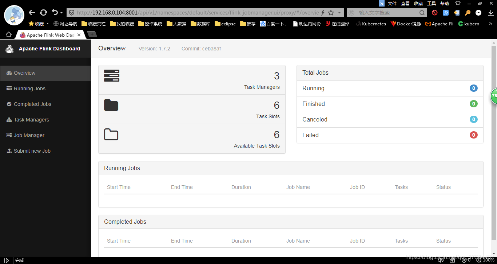

## 安装介绍
由于项目所需，需要从零开始部署flink on kubernetes。项目的生产环境是完全的内网，需要提前下载所有所需的安装包，进行离线安装。
我们公司没有人接触过kubernetes，只听说过，之前使用的flink都是flink on yarn，网上找了好多好多安装flink on kubernetes的文档，但几乎全都是在线安装，到处都少步骤，对于初次接触kubernetes的人特别不友好，看的人特别蒙。
网上的文档由于是在线安装，从头到尾两三个命令，两三个配置文件就搭建上了。然而离线安装和在线安装完全不同，网上的文档甚至都没有标明是在线安装，对于任何东西都要离线安装的我来说，基本没有意识到那些简单的步骤是在线安装，感觉就那么几步就安装好了，感觉不可思议，让我走了很多弯路。
离线安装的步骤东拼西凑才凑出来这么一套安装流程。
另外，网上flink on kubernetes的文章真的是相当少，遇到了问题想要找到解决方法都得自己想，网上基本没有可以参考的文章。
刚开始安装kubernetes时，我用的环境是redhat6.8，由于kubernetes对redhat支持率很低，而且7版本之前的linux安装docker，kubernetes也有很多不可预料的问题，折腾了两三天愣是装不上，所以除非是正在运行的生产环境没有办法更改操作系统，否则强烈建议使用centos7以上的系统安装kubernetes。再一个，现在7版本之前的linux系统已经过时了，现在新增linux服务器主流都在7以上，很多稍微新一点的软件版本都需要7以上的环境。


## 二、安装环境
### 1.服务器详情

| 服务器名称    | IP地址          | 操作系统      |
|----------|---------------|-----------|
| vmlinux4 | 192.168.0.104 | Centos7.7 |
| vmlinux5 | 192.168.0.105 | Centos7.7 |
| vmlinux6 | 192.168.0.106 | Centos7.7 |
### 2.安装包详情
| 软件             | 安装包                                      | 备注               |
|----------------|------------------------------------------|------------------|
| Docker         | docker-ce-cli-18.09.9-3.el7.x86_64.rpm   | kubernetes依赖     |
|                | container-selinux-2.107-3.el7.noarch.rpm | kubernetes依赖     |
|                | containerd.io-1.2.6-3.3.el7.x86_64.rpm   | kubernetes依赖     |
|                | docker-ce-18.09.9-3.el7.x86_64.rpm       | kubernetes依赖     |
| etcd           | etcd-v3.3.17-linux-amd64.tar.gz          | kubernetes依赖     |
| kubernetes     | kubernetes-node-linux-amd64.tar.gz       |                  |
|                | kubernetes-server-linux-amd64.tar.gz     |                  |
| flannel        | flannel-v0.11.0-linux-amd64.tar.gz       |                  | 
| docker-flink镜像 | flink:1.7.2                              | flink-docker镜像包  |
| pause镜像        | pause:3.1                                | k8s运行所需docker镜像包 |
## 三、安装步骤
### 1.安装docker
kubernetes集群需要docker作为底层，在三台服务器上安装docker
docker的安装很简单，只需要下载4个rpm包进行安装即可。
不建议使用源码安装，因为已经有这么简单高效的rpm包了，源码安装坑很多，在有rpm包的情况下，使用源码安装很浪费时间
只需按顺序安装4个相关包，连环境变量都不用设置，docker环境就部署完毕了

#### （1）下载安装包
docker需要4个安装包：
docker-ce-cli-18.09.9-3.el7.x86_64.rpm
container-selinux-2.107-3.el7.noarch.rpm
containerd.io-1.2.6-3.3.el7.x86_64.rpm
docker-ce-18.09.9-3.el7.x86_64.rpm
将这四个安装包上传到所有3台服务器上
下载地址：
[https://download.docker.com/linux/centos/7/x86_64/stable/Packages](https://download.docker.com/linux/centos/7/x86_64/stable/Packages)
[https://centos.pkgs.org/7/centos-extras-x86_64/container-selinux-2.107-3.el7.noarch.rpm.html](https://centos.pkgs.org/7/centos-extras-x86_64/container-selinux-2.107-3.el7.noarch.rpm.html)

#### （2）安装服务
```text
[root@vmlinux4 docker]# rpm -ivh docker-ce-cli-18.09.9-3.el7.x86_64.rpm 
[root@vmlinux4 docker]# rpm -ivh container-selinux-2.107-3.el7.noarch.rpm 
[root@vmlinux4 docker]# rpm -ivh containerd.io-1.2.6-3.3.el7.x86_64.rpm 
[root@vmlinux4 docker]# rpm -ivh docker-ce-18.09.9-3.el7.x86_64.rpm 
```


#### （3）启动服务
```text
[root@vmlinux4 docker]# service docker start
Redirecting to /bin/systemctl start docker.service
```
测试服务
```text
[root@vmlinux4 docker]# docker version
Client:
 Version:           18.09.9
 API version:       1.39
 Go version:        go1.11.13
 Git commit:        039a7df9ba
 Built:             Wed Sep  4 16:51:21 2019
 OS/Arch:           linux/amd64
 Experimental:      false

Server: Docker Engine - Community
 Engine:
  Version:          18.09.9
  API version:      1.39 (minimum version 1.12)
  Go version:       go1.11.13
  Git commit:       039a7df
  Built:            Wed Sep  4 16:22:32 2019
  OS/Arch:          linux/amd64
  Experimental:     false
```
docker的安装就完成了，在后面flannel的安装中还需要再对docker进行调整，这里先不做修改，在后面进行到相应的步骤时再进行调整

### 2.安装etcd集群
kubernetes需要etcd数据库作为底层数据库，需要在所有安装kubernetes的服务器上安装etcd集群，以下是集群的安装方式

#### （1）下载安装包
etcd包下载地址https://github.com/etcd-io/etcd/releases/tag/v3.3.17
将安装包分别上传到3个服务器
```text
[root@vmlinux1 ~]# cd /sga/etcd/
[root@vmlinux1 etcd]# ll
total 13896
-rw-r--r--.		1 root   root  14222547 Oct 23 11:08	 etcd-v3.3.17-linux-amd64.tar.gz
```

#### （2）创建etcd配置文件
在3台服务器解压安装包，改名，并将etcd etcdctl文件cp到/usr/bin目录
```text
[root@vmlinux1 etcd]# tar -zxvf etcd-v3.3.17-linux-amd64.tar.gz 
[root@vmlinux1 etcd]# ll
total 13896
drwxr-xr-x. 	5 478493 89939     4096 Oct 24 12:13	 etcd-v3.3.17-linux-amd64
-rw-r--r--.		1 root   root  14222547 Oct 23 11:08	 etcd-v3.3.17-linux-amd64.tar.gz
[root@vmlinux1 etcd]# cd etcd-v3.3.17-linux-amd64
[root@vmlinux1 etcd-v3.3.17-linux-amd64]# ll
total 39068
drwx------.	3 	root		root      4096 Oct 24 09:24	default.etcd
drwxr-xr-x.	10 	478493	89939     4096 Oct 12 01:25 	Documentation
-rwxr-xr-x.  	1 	478493	89939 22102784 Oct 12 01:25 	etcd
-rwxr-xr-x.  	1	478493	89939 17770784 Oct 12 01:25 	etcdctl
-rw-r--r--.  	1 	root		root     49109 Oct 24 13:04 	etcd_log.log
-rw-r--r--.  	1 	478493	89939    38864 Oct 12 01:25 	README-etcdctl.md
-rw-r--r--. 	1 	478493	89939     7262 Oct 12 01:25 	README.md
-rw-r--r--. 	1 	478493	89939     7855 Oct 12 01:25 	READMEv2-etcdctl.md
[root@vmlinux1 etcd]# cd ..
[root@vmlinux1 etcd]# mv etcd-v3.3.17-linux-amd64 etcd
[root@vmlinux4 etcd]# cp etcd/etcd etcd/etcdctl /usr/bin/
```
创建配置文件etcd.conf，这里的配置文件是集群的配置文件，单机的配置文件不同

```text
[root@vmlinux4 etcd]# cat etcd.conf
ETCD_NAME="my-etcd-1"
ETCD_LISTEN_CLIENT_URLS="http://0.0.0.0:2379"
#advertise-client-urls
ETCD_ADVERTISE_CLIENT_URLS="http://192.168.0.104:2379"
#listen-peer-urls
ETCD_LISTEN_PEER_URLS="http://0.0.0.0:2380"
#initial-advertise-peer-urls
ETCD_INITIAL_ADVERTISE_PEER_URLS="http://192.168.0.104:2380"
#initial-cluster-token
ETCD_INITIAL_CLUSTER_TOKER="etcd-cluster-test"
#initial-cluster-state
ETCD_INITIAL_CLUSTER_STATE="new"
#initial-cluster
ETCD_INITIAL_CLUSTER="my-etcd-1=http://192.168.0.104:2380,my-etcd-2=http://192.168.0.105:2380,my-etcd-3=http://192.168.0.106:2380"
```

#### （3）创建etcd服务文件
创建etcd启动的服务文件，通过创建服务文件，可以将etcd服务添加到service
```text
[root@vmlinux4 etcd]# cat /lib/systemd/system/etcd.service
[Unit]
Description=Etcd Server
After=network.target

[Service]
Type=simple
WorkingDirectory=/sga/etcd/etcd
EnvironmentFile=-/sga/etcd/etcd/etcd.conf
ExecStart=/usr/bin/etcd \
        --name=${ETCD_NAME} \
        --listen-client-urls=${ETCD_LISTEN_CLIENT_URLS} \
        --advertise-client-urls=${ETCD_ADVERTISE_CLIENT_URLS} \
        --listen-peer-urls=${ETCD_LISTEN_PEER_URLS} \
        --initial-advertise-peer-urls=${ETCD_INITIAL_ADVERTISE_PEER_URLS} \
        --initial-cluster=${ETCD_INITIAL_CLUSTER} \
        --initial-cluster-token=${ETCD_INITIAL_CLUSTER_TOKEN} \
        --initial-cluster-state=${ETCD_INITIAL_CLUSTER_STATE} \
        --initial-cluster=${ETCD_INITIAL_CLUSTER}
Type=notify

[Install]
WantedBy=multi-user.target
```
#### （3）启动etcd集群
创建好两个配置文件，集群就可以启动了
分别在三个服务器执行启动命令
```text
[root@vmlinux1 ~]# service etcd start
Redirecting to /bin/systemctl start etcd.service
[root@vmlinux4 etcd]# service etcd status
Redirecting to /bin/systemctl status etcd.service
● etcd.service - Etcd Server
   Loaded: loaded (/usr/lib/systemd/system/etcd.service; enabled; vendor preset: disabled)
   Active: active (running) since Wed 2019-11-06 11:11:35 CST; 5 days ago
 Main PID: 74969 (etcd)
    Tasks: 13
   Memory: 467.6M
   CGroup: /system.slice/etcd.service
           └─74969 /usr/bin/etcd --name=my-etcd-1 --listen-client-urls=http://0.0.0.0:2379 --advertise-client-urls=http://192.168.0.104:2379 --listen-peer-urls=http://...

Nov 12 09:21:48 vmlinux4 etcd[74969]: store.index: compact 1200814
Nov 12 09:21:48 vmlinux4 etcd[74969]: finished scheduled compaction at 1200814 (took 2.652259ms)
Nov 12 09:26:48 vmlinux4 etcd[74969]: store.index: compact 1201233
Nov 12 09:26:48 vmlinux4 etcd[74969]: finished scheduled compaction at 1201233 (took 988.471µs)
Nov 12 09:31:48 vmlinux4 etcd[74969]: store.index: compact 1201650
Nov 12 09:31:48 vmlinux4 etcd[74969]: finished scheduled compaction at 1201650 (took 1.123113ms)
Nov 12 09:36:48 vmlinux4 etcd[74969]: store.index: compact 1202068
Nov 12 09:36:48 vmlinux4 etcd[74969]: finished scheduled compaction at 1202068 (took 935.626µs)
Nov 12 09:41:48 vmlinux4 etcd[74969]: store.index: compact 1202485
Nov 12 09:41:48 vmlinux4 etcd[74969]: finished scheduled compaction at 1202485 (took 910.437µs)
```
#### （4）查看etcd集群状态
启动集群以后，看到如下状态就部署成功了
```text
[root@vmlinux6 etcd]# etcdctl member list
5672fb11ae669168: name=my-etcd-3 peerURLs=http://192.168.0.106:2380 clientURLs=http://192.168.0.106:2379 isLeader=false
5b83ad767f39380a: name=my-etcd-2 peerURLs=http://192.168.0.105:2380 clientURLs=http://192.168.0.105:2379 isLeader=false
e2803f940d8aa43f: name=my-etcd-1 peerURLs=http://192.168.0.104:2380 clientURLs=http://192.168.0.104:2379 isLeader=true

[root@vmlinux1 ~]# etcdctl cluster-health
member 5672fb11ae669168 is healthy: got healthy result from http://192.168.0.106:2379
member 5b83ad767f39380a is healthy: got healthy result from http://192.168.0.105:2379
member e2803f940d8aa43f is healthy: got healthy result from http://192.168.0.104:2379
cluster is healthy
```

### 3.安装kube-apiserver
第三步到第五步的服务是kubernetes的服务组件，即master端，在服务端（master）安装，我这里的服务端是vmlinux4
将下载的两个安装包上传到vmlinux4
kubernetes-server-linux-amd64.tar.gz
kubernetes-node-linux-amd64.tar.gz
```text
[root@vmlinux4 kubernetes]# ll
总用量 542448
drwxr-xr-x. 6 root root      4096 10月 31 17:48 kubernetes
-rw-r--r--. 1 root root  14253719 10月 31 17:22 kubernetes-client-linux-amd64.tar.gz
-rw-r--r--. 1 root root  14283993 10月 31 17:22 kubernetes-client-windows-amd64.tar.gz
-rw-r--r--. 1 root root 104282485 10月 31 17:23 kubernetes-node-linux-amd64.tar.gz
-rw-r--r--. 1 root root 422609440 10月 31 17:23 kubernetes-server-linux-amd64.tar.gz
```
解压kubernetes-server-linux-amd64.tar.gz
并将解压的目录改名kubernetes
```text
[root@vmlinux4 kubernetes]# cd kubernetes/
[root@vmlinux4 kubernetes]# ll
总用量 238020
drwxr-xr-x. 2 root root      4096 10月  6 2018 addons
drwxr-xr-x. 3 root root      4096 9月  22 2018 client
drwxr-xr-x. 2 root root      4096 11月  1 17:30 config
-rw-r--r--. 1 root root  28023710 10月  6 2018 kubernetes-src.tar.gz
-rw-r--r--. 1 root root   6102560 10月  6 2018 LICENSES
drwxr-xr-x. 3 root root      4096 10月  6 2018 server
```
将server/bin中的可执行文件复制到/usr/bin中
```text
[root@vmlinux4 bin]# cd server/bin
[root@vmlinux4 bin]# cp kube-apiserver kube-controller-manager kubectl kubelet kube-proxy /usr/bin
```
#### （1）创建kube-apiserver的配置文件
创建一个存放配置文件的目录，创建配置文件apiserver
具体配置如下
```text
[root@vmlinux4 config]# ll
total 28
-rw-r--r--. 1 root root  313 Nov 11 16:55 apiserver
-rw-r--r--. 1 root root  172 Nov  6 11:34 controller-manager
-rw-r--r--. 1 root root  355 Nov 11 16:55 kubelet
-rw-r--r--. 1 root root  234 Oct 31 17:48 kubelet.kubeconfig
-rw-r--r--. 1 root root  112 Nov  8 12:00 kube-proxy
-rw-r--r--. 1 root root   90 Nov  4 09:05 scheduler
-rw-r--r--. 1 root root 1679 Nov  6 11:09 serviceaccount.key
[root@vmlinux4 config]# pwd
/sga/kubernetes/kubernetes/config
[root@vmlinux4 config]# cat apiserver
KUBE_API_ARGS="--service-account-key-file=/sga/kubernetes/kubernetes/config/serviceaccount.key --logtostderr=true --v=4 --etcd-servers=http://192.168.0.104:2379 --insecure-bind-address=0.0.0.0 --insecure-port=8080 --advertise-address=192.168.0.104 --allow-privileged=true --service-cluster-ip-range=192.0.0.0/24"
```

#### （2）创建kube-apiserver服务
创建kube-apiserver服务的启动文件
```text
[root@vmlinux4 kubernetes]# cat /lib/systemd/system/kube-apiserver.service
[Unit]
Description=Kubernetes API Server
Documentation=https://github.com/GoogleCloudPlatform/kubernetes
After=network.target
After=etcd.service
[Service]
EnvironmentFile=-/sga/kubernetes/kubernetes/config/apiserver
ExecStart=/usr/bin/kube-apiserver $KUBE_API_ARGS
Restart=on-failure
Type=notify
LimitNOFILE=65536
[Install]
WantedBy=multi-user.target
```
#### （3）启动kube-apiserver服务
```text
[root@vmlinux4 config]# service kube-apiserver start
Redirecting to /bin/systemctl start kube-apiserver.service
[root@vmlinux4 config]# service kube-apiserver status
Redirecting to /bin/systemctl status kube-apiserver.service
● kube-apiserver.service - Kubernetes API Server
   Loaded: loaded (/usr/lib/systemd/system/kube-apiserver.service; disabled; vendor preset: disabled)
   Active: active (running) since Mon 2019-11-11 16:57:02 CST; 17h ago
     Docs: https://github.com/GoogleCloudPlatform/kubernetes
 Main PID: 88747 (kube-apiserver)
    Tasks: 12
   Memory: 237.0M
   CGroup: /system.slice/kube-apiserver.service
           └─88747 /usr/bin/kube-apiserver --service-account-key-file=/sga/kubernetes/kubernetes/config/serviceaccount.key --logtostderr=true --v=4 --etcd-servers=http...

Nov 12 10:01:04 vmlinux4 kube-apiserver[88747]: I1112 10:01:04.222112   88747 wrap.go:42] PUT /apis/apiregistration.k8s.io/v1/apiservices/v1beta1.storage.k8s...:1]:57015]
Nov 12 10:01:04 vmlinux4 kube-apiserver[88747]: I1112 10:01:04.491035   88747 wrap.go:42] GET /api/v1/namespaces/kube-system/endpoints/kube-scheduler?timeout...104:43405]
Nov 12 10:01:04 vmlinux4 kube-apiserver[88747]: I1112 10:01:04.501490   88747 wrap.go:42] PUT /api/v1/namespaces/kube-system/endpoints/kube-scheduler?timeout...104:43405]
Nov 12 10:01:05 vmlinux4 kube-apiserver[88747]: I1112 10:01:05.199210   88747 wrap.go:42] GET /apis/scheduling.k8s.io/v1beta1/priorityclasses?resourceVersion...:1]:57015]
Nov 12 10:01:05 vmlinux4 kube-apiserver[88747]: I1112 10:01:05.199583   88747 reflector.go:357] k8s.io/kubernetes/pkg/client/informers/informers_generated/in...s received
Nov 12 10:01:05 vmlinux4 kube-apiserver[88747]: I1112 10:01:05.200498   88747 get.go:245] Starting watch for /apis/scheduling.k8s.io/v1beta1/priorityclasses,...eout=9m12s
Nov 12 10:01:05 vmlinux4 kube-apiserver[88747]: I1112 10:01:05.959651   88747 wrap.go:42] GET /api/v1/namespaces/kube-system/endpoints/kube-controller-manage...104:30938]
Nov 12 10:01:05 vmlinux4 kube-apiserver[88747]: I1112 10:01:05.967240   88747 wrap.go:42] PUT /api/v1/namespaces/kube-system/endpoints/kube-controller-manage...104:30938]
Nov 12 10:01:06 vmlinux4 kube-apiserver[88747]: I1112 10:01:06.513381   88747 wrap.go:42] GET /api/v1/namespaces/kube-system/endpoints/kube-scheduler?timeout...104:43405]
Nov 12 10:01:06 vmlinux4 kube-apiserver[88747]: I1112 10:01:06.520963   88747 wrap.go:42] PUT /api/v1/namespaces/kube-system/endpoints/kube-scheduler?timeout...104:43405]
Hint: Some lines were ellipsized, use -l to show in full.
```

### 4.安装kube-controller-manager
此服务是kubernetes-server-linux-amd64.tar.gz中的组件，在服务端安装

#### （1）创建controller-manager配置文件
在config目录中创建controller-manager的配置文件controller-manager
```text
[root@vmlinux4 config]# pwd
/sga/kubernetes/kubernetes/config
[root@vmlinux4 config]# ll
总用量 12
-rw-r--r--. 1 root root 234 11月  1 17:07 apiserver
-rw-r--r--. 1 root root  84 11月  1 17:30 controller-manager
[root@vmlinux4 config]# cat controller-manager
KUBE_CONTROLLER_MANAGER_ARGS="--logtostderr=true --v=4 --master=192.168.0.104:8080"
```
#### （2）创建 controller-manager服务
创建controller-manager的服务启动文件
```text
[root@vmlinux4 config]# cat /lib/systemd/system/kube-controller-manager.service
[Unit]
Description=Kubernetes Controller Manager
Documentation=https://github.com/GoogleCloudPlatform/kubernetes
[Service]
EnvironmentFile=-/sga/kubernetes/kubernetes/config/controller-manager
ExecStart=/usr/bin/kube-controller-manager $KUBE_CONTROLLER_MANAGER_ARGS
Restart=on-failure
LimitNOFILE=65536
[Install]
WantedBy=multi-user.target
```

#### （3）启动kube-controller-manager服务
```text
[root@vmlinux4 config]# service kube-apiserver start
Redirecting to /bin/systemctl start kube-apiserver.service
[root@vmlinux4 config]# service kube-apiserver status
Redirecting to /bin/systemctl status kube-apiserver.service
● kube-apiserver.service - Kubernetes API Server
   Loaded: loaded (/usr/lib/systemd/system/kube-apiserver.service; disabled; vendor preset: disabled)
   Active: active (running) since 五 2019-11-01 17:07:26 CST; 5s ago
     Docs: https://github.com/GoogleCloudPlatform/kubernetes
 Main PID: 6707 (kube-apiserver)
    Tasks: 10
   Memory: 269.6M
   CGroup: /system.slice/kube-apiserver.service
           └─6707 /usr/bin/kube-apiserver --logtostderr=true --v=4 --etcd-servers=http://192.168.0.104:2379 --insecure-bind-address=0.0.0.0 --insecure-port=8080 --ad...

11月 01 17:07:27 vmlinux4 kube-apiserver[6707]: I1101 17:07:27.293559    6707 wrap.go:42] PUT /apis/apiregistration.k8s.io/v1/apiservices/v1.authentication...1]:39204]
11月 01 17:07:27 vmlinux4 kube-apiserver[6707]: I1101 17:07:27.294208    6707 wrap.go:42] PUT /apis/apiregistration.k8s.io/v1/apiservices/v2beta2.autoscali...1]:39204]
11月 01 17:07:27 vmlinux4 kube-apiserver[6707]: I1101 17:07:27.295948    6707 wrap.go:42] PUT /apis/apiregistration.k8s.io/v1/apiservices/v1beta1.apiextens...1]:39204]
11月 01 17:07:27 vmlinux4 kube-apiserver[6707]: I1101 17:07:27.297403    6707 wrap.go:42] PUT /apis/apiregistration.k8s.io/v1/apiservices/v1beta1.policy/st...1]:39204]
11月 01 17:07:27 vmlinux4 kube-apiserver[6707]: I1101 17:07:27.986544    6707 wrap.go:42] GET /api/v1/namespaces/kube-system: (3.772385ms) 200 [kube-apiser...1]:39204]
11月 01 17:07:27 vmlinux4 kube-apiserver[6707]: I1101 17:07:27.986614    6707 wrap.go:42] GET /apis/scheduling.k8s.io/v1beta1/priorityclasses/system-node-c...1]:39204]
11月 01 17:07:27 vmlinux4 kube-apiserver[6707]: I1101 17:07:27.992903    6707 wrap.go:42] GET /apis/scheduling.k8s.io/v1beta1/priorityclasses/system-cluste...1]:39204]
11月 01 17:07:27 vmlinux4 kube-apiserver[6707]: I1101 17:07:27.993907    6707 wrap.go:42] GET /api/v1/namespaces/kube-system/configmaps/extension-apiserver...1]:39204]
11月 01 17:07:27 vmlinux4 kube-apiserver[6707]: I1101 17:07:27.996664    6707 storage_scheduling.go:100] all system priority classes are created successful...dy exist.
11月 01 17:07:28 vmlinux4 kube-apiserver[6707]: I1101 17:07:28.000849    6707 wrap.go:42] PUT /api/v1/namespaces/kube-system/configmaps/extension-apiserver...1]:39204]
Hint: Some lines were ellipsized, use -l to show in full.
```

### 5.安装kube-scheduler
kube-scheduler在服务端安装
#### （1）创建kube-controller-manager配置文件
```text
[root@vmlinux4 config]# cat scheduler
KUBE_SCHEDULER_ARGS="--logtostderr=true --v=4 --master=192.168.0.104:8080 --leader-elect"
```

#### （2）创建kube-scheduler服务文件
```text
[root@vmlinux4 config]# cat /lib/systemd/system/kube-scheduler.service
[Unit]
Description=Kubernetes Scheduler Plugin
Documentation=https://github.com/GoogleCloudPlatform/kubernetes
[Service]
EnvironmentFile=-/sga/kubernetes/kubernetes/config/scheduler
ExecStart=/usr/bin/kube-scheduler $KUBE_SCHEDULER_ARGS
Restart=on-failure
LimitNOFILE=65536
[Install]
WantedBy=multi-user.target
```
#### （3）启动kube-scheduler服务
```text
[root@vmlinux4 config]# service kube-scheduler status
Redirecting to /bin/systemctl status kube-scheduler.service
● kube-scheduler.service - Kubernetes Scheduler Plugin
   Loaded: loaded (/usr/lib/systemd/system/kube-scheduler.service; disabled; vendor preset: disabled)
   Active: active (running) since 一 2019-11-11 16:56:53 CST; 6 days ago
     Docs: https://github.com/GoogleCloudPlatform/kubernetes
 Main PID: 88984 (kube-scheduler)
    Tasks: 11
   Memory: 20.0M
   CGroup: /system.slice/kube-scheduler.service
           └─88984 /usr/bin/kube-scheduler --logtostderr=true --v=4 --master=192.168.0.104:8080 --leader-elect

11月 18 08:37:04 vmlinux4 kube-scheduler[88984]: I1118 08:37:04.461613   88984 leaderelection.go:227] successfully renewed lease kube-system/kube-scheduler
11月 18 08:37:06 vmlinux4 kube-scheduler[88984]: I1118 08:37:06.474800   88984 leaderelection.go:227] successfully renewed lease kube-system/kube-scheduler
11月 18 08:37:08 vmlinux4 kube-scheduler[88984]: I1118 08:37:08.490991   88984 leaderelection.go:227] successfully renewed lease kube-system/kube-scheduler
11月 18 08:37:08 vmlinux4 kube-scheduler[88984]: I1118 08:37:08.941170   88984 reflector.go:357] k8s.io/client-go/informers/factory.go:131: Watch close - *... received
11月 18 08:37:10 vmlinux4 kube-scheduler[88984]: I1118 08:37:10.512228   88984 leaderelection.go:227] successfully renewed lease kube-system/kube-scheduler
11月 18 08:37:12 vmlinux4 kube-scheduler[88984]: I1118 08:37:12.526609   88984 leaderelection.go:227] successfully renewed lease kube-system/kube-scheduler
11月 18 08:37:14 vmlinux4 kube-scheduler[88984]: I1118 08:37:14.541069   88984 leaderelection.go:227] successfully renewed lease kube-system/kube-scheduler
11月 18 08:37:16 vmlinux4 kube-scheduler[88984]: I1118 08:37:16.559766   88984 leaderelection.go:227] successfully renewed lease kube-system/kube-scheduler
11月 18 08:37:18 vmlinux4 kube-scheduler[88984]: I1118 08:37:18.573130   88984 leaderelection.go:227] successfully renewed lease kube-system/kube-scheduler
11月 18 08:37:20 vmlinux4 kube-scheduler[88984]: I1118 08:37:20.588158   88984 leaderelection.go:227] successfully renewed lease kube-system/kube-scheduler
Hint: Some lines were ellipsized, use -l to show in full.
```

### 6.安装kubelet
所有服务器都安装kubelet，在所有的服务器上创建如下三个配置文件
#### （1）创建kubeconfig配置文件
```text
[root@vmlinux4 ~]# vim /sga/kubernetes/kubernetes/config/kubelet.kubeconfig
apiVersion: v1
kind: Config
clusters:
  - cluster:
      server: http://192.168.0.104:8080                ###Master的IP，即自身IP
    name: local
contexts:
  - context:
      cluster: local
    name: local
current-context: local    
```

#### （2）创建kubelet配置文件
创建kubelet配置文件
````text
[root@vmlinux4 config]# cat kubelet
KUBE_KUBELET_ARGS="--feature-gates=AttachVolumeLimit=false --cluster_dns=10.10.10.10 --cluster_domain=cluster.local --logtostderr=true --v=4 --address=192.168.0.104 --port=10250 --hostname-override=192.168.0.104 --kubeconfig=/sga/kubernetes/kubernetes/config/kubelet.kubeconfig --allow-privileged=true --cluster-domain=cluster.local --fail-swap-on=false"
````
#### （3）创建kubelet服务文件
创建kubelet启动的服务文件
```text
[root@vmlinux4 config]# cat /lib/systemd/system/kubelet.service
[Unit]
Description=Kubernetes Kubelet
After=docker.service
Requires=docker.service
[Service]
EnvironmentFile=-/sga/kubernetes/kubernetes/config/kubelet
ExecStart=/usr/bin/kubelet $KUBE_KUBELET_ARGS
Restart=on-failure
KillMode=process
[Install]
WantedBy=multi-user.target
```
#### （4）启动服务，并设置开机启动
```text
[root@server1 ~]# swapoff -a ###启动之前要先关闭swap
[root@server1 ~]# systemctl enable kubelet
[root@server1 ~]# systemctl start kubelet
```


### 7.安装kube-proxy
所有服务器都安装kube-proxy，创建如下两个配置文件

#### （1）创建proxy配置文件
在config目录创建配置文件
```text
[root@vmlinux4 config]# cat kube-proxy
KUBE_PROXY_ARGS="--logtostderr=true --v=4 --hostname-override=192.168.0.104 --master=http://192.168.0.104:8080"
```
#### （2）创建proxy服务文件
创建proxy服务的启动文件
```text
[root@vmlinux4 config]# cat /lib/systemd/system/kube-proxy.service
[Unit]
Description=Kubernetes Proxy
After=network.target
[Service]
EnvironmentFile=-/sga/kubernetes/kubernetes/config/kube-proxy
ExecStart=/usr/bin/kube-proxy $KUBE_PROXY_ARGS
Restart=on-failure
[Install]
WantedBy=multi-user.target
```
#### （3）启动服务
### 8．安装flannel
所有服务器都安装

#### （1）创建配置文件
```text
[root@vmlinux4 config]# pwd
/sga/kubernetes/flannel/config
[root@vmlinux4 config]# cat flanneld.conf
# Flanneld configuration options
# etcd url location.  Point this to the server where etcd runs，自身IP
FLANNEL_ETCD="http://192.168.0.104:2379"

# etcd config key.  This is the configuration key that flannel queries
# For address range assignment，etcd-key的目录
FLANNEL_ETCD_KEY="/etc/kubernetes/network"

# Any additional options that you want to pass，根据自己的网卡名填写
FLANNEL_OPTIONS="--iface=ens33"
```

#### （2）创建服务文件
```text
[root@vmlinux4 config]# cat /lib/systemd/system/flanneld.service
[Unit]
Description=Flanneld overlay address etcd agent
After=network.target
After=network-online.target
Wants=network-online.target
After=etcd.service
Before=docker.service

[Service]
Type=notify
EnvironmentFile=/sga/kubernetes/flannel/config/flanneld.conf
ExecStart=/usr/bin/flanneld -etcd-endpoints=${FLANNEL_ETCD} -etcd-prefix=${FLANNEL_ETCD_KEY} $FLANNEL_OPTIONS
ExecStartPost=/usr/bin/mk-docker-opts.sh -k DOCKER_NETWORK_OPTIONS -d /run/flannel/docker
Restart=on-failure

[Install]
WantedBy=multi-user.target
RequiredBy=docker.service
```
#### （3）配置etcd
此处对应配置文件中的FLANNEL_ETCD_KEY="/etc/kubernetes/network"
```text
[root@vmlinux4 config]# etcdctl set /etc/kubernetes/network/config '{"Network": "172.20.0.0/16"}'
```

#### （4）配置docker
上文中提到的docker的调整
修改docker.service在[Service]添加如下参数，是为了由flannel统一接管docker的服务请求，flannel运行生成一个配置文件，docker调用这个配置文件使docker的VIP与flannel的VIP处于同一网段，如此才能由flannel来统一管理
```text
[root@vmlinux4 config]# vim /lib/systemd/system/docker.service
[Service]
Type=notify
# the default is not to use systemd for cgroups because the delegate issues still
# exists and systemd currently does not support the cgroup feature set required
EnvironmentFile=-/sga/kubernetes/flannel/config/flanneld
EnvironmentFile=-/run/flannel/subnet.env #flannel生成的配置文件
ExecStart=/usr/bin/dockerd -H fd:// --containerd=/run/containerd/containerd.sock --bip=${FLANNEL_SUBNET}
ExecReload=/bin/kill -s HUP $MAINPID
TimeoutSec=0
RestartSec=2
Restart=always
```
执行命令刷新服务
```text
[root@vmlinux5 config]# systemctl daemon-reload
[root@vmlinux5 config]# sercice flannel restart
[root@vmlinux5 config]# sercice docker restart
```
#### （5）启动验证服务
查看docker与flannel的ip处于同一网段即可
```text
[root@vmlinux4 config]# ip addr
7: docker0: <NO-CARRIER,BROADCAST,MULTICAST,UP> mtu 1500 qdisc noqueue state DOWN group default
    link/ether 02:42:a8:a9:f1:83 brd ff:ff:ff:ff:ff:ff
    inet 172.20.64.1/24 brd 172.20.64.255 scope global docker0
       valid_lft forever preferred_lft forever
9: flannel0: <POINTOPOINT,MULTICAST,NOARP,UP,LOWER_UP> mtu 1472 qdisc pfifo_fast state UNKNOWN group default qlen 500
    link/none
    inet 172.20.64.0/32 scope global flannel0
       valid_lft forever preferred_lft forever
    inet6 fe80::5ddd:d4ba:8977:1fad/64 scope link flags 800
       valid_lft forever preferred_lft forever
```

### 9．准备docker-flink镜像
#### （1）下载镜像
由于是离线部署flink，所以需要提前下载flink-docker镜像，我对于docker镜像还不是很了解，不知道能不能使用flink的安装包来制作docker镜像，所以只能联网下载，以后再做研究
将服务器联网

```text
[root@vmlinux4 conf]# docker pull flink:1.7.2
1.7.2: Pulling from library/flink
9cc2ad81d40d: Pull complete
e6cb98e32a52: Pull complete
ae1b8d879bad: Pull complete
2383fa4462e7: Pull complete
7ac3ce9f2067: Pull complete
ce9a16d8ddcb: Pull complete
d0078391b205: Pull complete
cb7d61aa945e: Pull complete
5dcb8e0f7236: Pull complete
f3f880699fcf: Pull complete
ffa37d915f80: Pull complete
0b51594f6132: Pull complete
Digest: sha256:02847d6cc09bfe5fa6c1f347e499984af44537f68188578d6173636618ae7a39
Status: Downloaded newer image for flink:1.7.2
```

下载pause:3.1镜像
```text
[root@vmlinux4 pods]# docker pull registry.cn-beijing.aliyuncs.com/zhoujun/pause:3.1
```
将下载的pause镜像改名

#### （2）查看镜像
```text
[root@vmlinux4 pods]# docker image ls
REPOSITORY		TAG		IMAGE ID			CREATED			SIZE
fink			 	1.7		cb399bafceb4		2 months ago		534MB
flink				1.7.2	cb399bafceb4		2 months ago		534MB
k8s.gcr.io/pause	3.1		da86e6ba6ca1		22 months ago	742kB
```

#### （3）镜像打包
```text
[root@vmlinux4 pods]# docker save fink:1.7 > flink.tar
[root@vmlinux4 pods]# docker save k8s.gcr.io/pause:3.1 > pause3.1.tar
```
将镜像传送到所有服务器上

#### （4）镜像导入
在其余服务器上导入相应的包
```text
[root@vmlinux4 pods]# docker load < flink.tar
[root@vmlinux4 pods]# docker load < pause3.1.tar
```
至此，k8s运行flink集群所需的镜像包下载完成


### 10．flink on kubernetes配置
经过前面那些步骤的安装配置以后，才进入到主题：flink on kubernetes的配置

#### （1）创建kubernetes服务文件
flink on kubernetes有两种运行模式，一种会话集群，一种工作集群，这里采用会话集群的模式进行部署，共三个文件，分别如下
```text
[root@vmlinux4 pods]# cat jobmanager-service.yaml
apiVersion: v1
kind: Service
metadata:
    name: flink-jobmanager
spec:
    clusterIP: 192.0.0.200
    ports:
    - name: rpc
      port: 6123
    - name: blob
      port: 6124
    - name: query
      port: 6125
    - name: ui
      port: 8081
    selector:
        app: flink
        component: jobmanager
```
```text
[root@vmlinux4 pods]# cat jobmanager-deployment.yaml
apiVersion: extensions/v1beta1
kind: Deployment
metadata:
    name: flink-jobmanager
spec:
    replicas: 1
    template:
        metadata:
            labels:
                app: flink
                component: jobmanager
        spec:
            containers:
            - name: jobmanager
              image: flink:1.7
              args:
              - jobmanager
              ports:
              - containerPort: 6123
                name: rpc
              - containerPort: 6124
                name: blob
              - containerPort: 6125
                name: query
              - containerPort: 8081
                name: ui
              env:
              - name: JOB_MANAGER_RPC_ADDRESS
                value: 192.0.0.200

```
```text
[root@vmlinux4 pods]# cat taskmanager-deployment.yaml
apiVersion: extensions/v1beta1
kind: Deployment
metadata:
    name: flink-taskmanager
spec:
    replicas: 3
    template:
        metadata:
            labels:
                app: flink
                component: taskmanager
        spec:
            containers:
            - name: taskmanager
              image: flink:1.7
              args:
              - taskmanager
              ports:
              - containerPort: 6121
                name: data
              - containerPort: 6122
                name: rpc
              - containerPort: 6125
                name: query
              env:
              - name: JOB_MANAGER_RPC_ADDRESS
                value: 192.0.0.200

```

#### （2）启动flink会话集群
```text
[root@vmlinux4 pods]# kubectl create -f jobmanager-service.yaml
service/flink-jobmanager create
[root@vmlinux4 pods]# kubectl create -f jobmanager-deployment.yaml
deployment.extensions/flink-jobmanager create
[root@vmlinux4 pods]# kubectl create -f taskmanager-deployment.yaml
deployment.extensions/flink-taskmanager create
```
集群启动完成
查看启动情况
```text
[root@vmlinux4 pods]# kubectl get pod -o wide
NAME                                READY   STATUS    RESTARTS   AGE    IP            NODE            NOMINATED NODE
flink-jobmanager-84f5464b7c-h74gt   1/1     Running   0          130m   172.20.87.2   192.168.0.106   <none>
flink-taskmanager-8d856fc49-b9sx9   1/1     Running   0          130m   172.20.69.2   192.168.0.105   <none>
flink-taskmanager-8d856fc49-vpz99   1/1     Running   0          130m   172.20.87.3   192.168.0.106   <none>
flink-taskmanager-8d856fc49-xfdr2   1/1     Running   0          130m   172.20.64.2   192.168.0.104   <none>
```
#### （3）启动service的对外服务
```text
[root@vmlinux4 pods]# kubectl proxy --address=’192.168.0.104’ -p=8001 --accept-hosts=’^*$’
Staring to server on 192.168.0.104:8001
```
#### （4）访问flink
在浏览器输入地址
http://192.168.0.104:8001/api/v1/namespaces/default/services/flink-jobmanager:ui/proxy
访问flink


## 四、报错处理
以下是安装过程中遇到的报错
### 1.启动etcd报错
```text
[root@vmlinux1 bin]# kube-apiserver $KUBE_API_ARGS
[root@vmlinux1 bin]# echo $KUBE_API_ARGS
–storage-backend=etcd3 --etcd-servers=http://192.168.0.101:2379 --insecure-bind-address=0.0.0.0 --insecure-port=8080 --service-cluster-ip-range=169.169.0.0/16 --service-node-port-range=1-65535 --admission-control=NamespaceLifecycle,LimitRanger,ResourceQuota --logtostderr=false --log-dir=/var/log/kubernets/log --v=2

E1024 16:42:22.290363 93923 repair.go:171] the cluster IP 10.0.0.1 for service kubernetes/default is not within the service CIDR 169.169.0.0/16; please recreate
E1024 16:42:22.290861 93923 repair.go:188] the cluster IP 10.0.0.1 may have leaked: flagging for later clean up
E1024 16:42:22.293248 93923 repair.go:195] the cluster IP 10.0.0.1 may have leaked, but can not be allocated: provided IP is not in the valid range. The range of valid IPs is 169.169.0.0/16
E1024 16:42:22.320465 93923 repair.go:171] the cluster IP 10.0.0.1 for service kubernetes/default is not within the service CIDR 169.169.0.0/16; please recreate

```
启动etcd报错
rafthttp: failed to find member as2das3eadasd in cluster 2323432kjh4bjwhbd
注意:节点删除后，集群中的成员信息会更新，新节点加入集群是作为一个全新的节点加入，如果data-dir有数据，etcd启动时会读取己经存在的数据，启动时仍然用的老member ID,也会造成，集群不无法加入，所以一定要清空新节点的data-dir
```text
etcdctl mk /atomic.io/network/config “{ “Network”: “172.17.0.0/16”, “SubnetLen”: 24, “Backend”: { “Type”: “vxlan” } }” { “Network”: “172.17.0.0/16”, “SubnetLen”: 24,“Backend”: { “Type”: “vxlan” } }
```

### 2.Etcd启动若出现E | rafthttp: request sent was ignored (cluster ID mismatch: peer… local=…)
删除etcd各个服务器根目录下的my-etcd-1.etcd目录重新启动

### 3.Unable to configure the docker daemon with file /etc/docker/daemon.json
删除文件/etc/docker/daemon.json

### 4.Kubectl get pods时报错No resources found
生成秘钥到配置文件目录
openssl genrsa -out /…
修改kube-apiserver配置文件
添加–service-account-key-file=/…/serviceaccount.key
修改kube-controller-manager配置文件
添加–service-account-private-key-file=/…/serviceaccount.key
重启etcd,docker,flanneld,kube-apiserver,kube-controller-manager,kube-scheduler,kube-proxy,kubelet

### 5.Warning MissingClusterDNS
```text
[root@vmlinux4 ~]# kubectl get pods -o wide
NAME READY STATUS RESTARTS AGE IP NODE NOMINATED NODE
flink-jobmanager-5f6879585d-tswht 0/1 ContainerCreating 0 20h 192.168.0.105
flink-taskmanager-69d55dd9bb-2hrgd 0/1 ContainerCreating 0 20h 192.168.0.105
flink-taskmanager-69d55dd9bb-dp6nx 0/1 ContainerCreating 0 20h 192.168.0.106
flink-taskmanager-69d55dd9bb-vdssm 0/1 ContainerCreating 0 20h 192.168.0.104

[root@vmlinux4 ~]# kubectl describe pod flink-jobmanager-5f6879585d-tswht
Warning MissingClusterDNS 4m11s (x5769 over 20h) kubelet, 192.168.0.105 pod: “flink-jobmanager-5f6879585d-tswht_default(886b9cbc-0046-11ea-8468-000c2952c691)”. kubelet does not have ClusterDNS IP configured and cannot create Pod using “ClusterFirst” policy. Falling back to “Default” policy.
```
kubelet添加参数–cluster_dns=10.10.10.10 --cluster_domain=cluster.local

### 6.Kubernetes从k8s.gcr.io拉取镜像失败问题
kubectl describe pod flink-jobmanager
mage pull failed for gcr.io/google_containers/pause:2.0
Kubernetes从k8s.gcr.io拉取镜像失败问题，pause-amd64:3.1、pause:3.1、kube相关的基础镜像
在国内，通过Docker的pull和push命令访问hub.docker时，网络十分慢，而且会出现各种各样的网络连接问题。而且像部分k8s必须的镜像无法下载下来。

解决办法，可从国内的镜像仓库下载下来，通过docker tar指令修改成相应的版本，示例如下：

docker pull registry.cn-beijing.aliyuncs.com/zhoujun/pause-amd64:3.1
docker pull registry.cn-beijing.aliyuncs.com/zhoujun/kube-proxy-amd64:v1.11.3
docker pull registry.cn-beijing.aliyuncs.com/zhoujun/kube-scheduler-amd64:v1.11.3
docker pull registry.cn-beijing.aliyuncs.com/zhoujun/coredns:1.1.3
docker pull registry.cn-beijing.aliyuncs.com/zhoujun/pause:3.1
docker pull registry.cn-beijing.aliyuncs.com/zhoujun/kube-controller-manager-amd64:v1.11.3
docker pull registry.cn-beijing.aliyuncs.com/zhoujun/kube-apiserver-amd64:v1.11.3
docker pull registry.cn-beijing.aliyuncs.com/zhoujun/etcd-amd64:3.2.18
然后修改版本：

docker tag registry.cn-beijing.aliyuncs.com/zhoujun/kube-proxy-amd64:v1.11.3 k8s.gcr.io/kube-proxy-amd64:v1.11.3
docker tag registry.cn-beijing.aliyuncs.com/zhoujun/kube-scheduler-amd64:v1.11.3 k8s.gcr.io/kube-scheduler-amd64:v1.11.3
docker tag registry.cn-beijing.aliyuncs.com/zhoujun/kube-apiserver-amd64:v1.11.3 k8s.gcr.io/kube-apiserver-amd64:v1.11.3
docker tag registry.cn-beijing.aliyuncs.com/zhoujun/kube-controller-manager-amd64:v1.11.3 k8s.gcr.io/kube-controller-manager-amd64:v1.11.3
docker tag registry.cn-beijing.aliyuncs.com/zhoujun/etcd-amd64:3.2.18 k8s.gcr.io/etcd-amd64:3.2.18
docker tag registry.cn-beijing.aliyuncs.com/zhoujun/pause:3.1 k8s.gcr.io/pause:3.1
docker tag registry.cn-beijing.aliyuncs.com/zhoujun/coredns:1.1.3 k8s.gcr.io/coredns:1.1.3
docker tag registry.cn-beijing.aliyuncs.com/zhoujun/pause-amd64:3.1 k8s.gcr.io/pause-amd64:3.1
ok！

### 7.flink docker镜像下载
联网，docker pull flink:1.7.2

### 8.打包docker镜像
#将镜像存储
docker save nginx:latest > /root/docker-images/nginx.tar
#导入镜像文件
docker load --input /root/docker-images/nginx.tar
#通过符号的方式来导入
docker load < /root/docker-images/nginx.tar

### 9.pulled kubelet,192.168.0.104 Container image “flink:1.7” already prsent on machine
pulled kubelet,192.168.0.104 Back-off restarting failed container
修改docker.service，在service模块添加参数MountFlags=shared， 此参数默认为MountFlags=slave

### 10.pod报错"Back-off restarting failed container"解决办法
在deployment申明镜像的后面加上命令
command: [ “/bin/bash”, “-ce”, “tail -f /dev/null” ]

### 11.kubernetes v1.2.0进行kubectl version和kubectl get nodes出现localhost:8080 connection refused的问题
kebuctl -s http://apiserverIP:8080 version
应该可以设置master

### 12.访问http://localhost:8001/api/v1/namespaces/default/services/flink-jobmanager:ui/proxy 出现

unauthorized

kubectl proxy --address=‘192.168.0.104’ -p=’8001’ --accept-hosts=’^*$’
### 13.常用命令
查看服务以及使用的端口
kubectl get -n namespace svc
kubectl create -f …yaml
kubectl describe pod …
kubectl get pods -o wide
docker image ls
kubectl get namespace
kubectl get deployment
kubectl logs flink-job…

### 14.task-manager启动报错 java.net.unknownhostexception: flink-jobmanager: temporary failure in name resolution
在kubernetes service文件的spec:中加入clusterIP: 10.0.0.200
修改deployment文件中的env: value:flink-jobmanager 10.0.0.200


