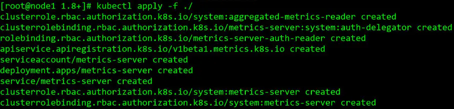
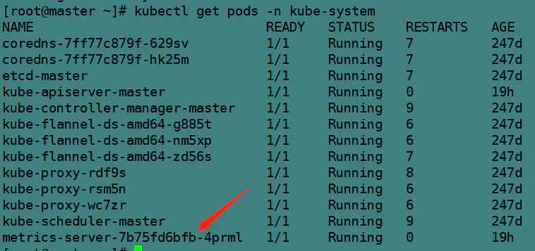

# 资料1: 部署metrics-server 采集pod资源占用数据 


metrics-server可以采集各个pod上的资源占用数据，如内存、cpu占用率。

## 部署metrics-server 采集pod资源占用数据
```text
# 检查该配置是否开启，如果内容出现了--enable-aggregator-routing=true则说明开启了，如果没有则未开始，需要进行接下来操作
 
[root@k8smaster 1.8+]# ps -ef|grep apiserver
root       4679 103065  0 21:42 pts/1    00:00:00 grep --color=auto apiserver
root     130738 130721  6 21:18 ?        00:01:36 kube-apiserver --advertise-address=192.168.204.143 --allow-privileged=true --authorization-mode=Node,RBAC --client-ca-file=/etc/kubernetes/pki/ca.crt --enable-admission-plugins=NodeRestriction --enable-bootstrap-token-auth=true --enable-aggregator-routing=true --etcd-cafile=/etc/kubernetes/pki/etcd/ca.crt --etcd-certfile=/etc/kubernetes/pki/apiserver-etcd-client.crt --etcd-keyfile=/etc/kubernetes/pki/apiserver-etcd-client.key --etcd-servers=https://127.0.0.1:2379 --insecure-port=0 --kubelet-client-certificate=/etc/kubernetes/pki/apiserver-kubelet-client.crt --kubelet-client-key=/etc/kubernetes/pki/apiserver-kubelet-client.key --kubelet-preferred-address-types=InternalIP,ExternalIP,Hostname --proxy-client-cert-file=/etc/kubernetes/pki/front-proxy-client.crt --proxy-client-key-file=/etc/kubernetes/pki/front-proxy-client.key --requestheader-allowed-names=front-proxy-client --requestheader-client-ca-file=/etc/kubernetes/pki/front-proxy-ca.crt --requestheader-extra-headers-prefix=X-Remote-Extra- --requestheader-group-headers=X-Remote-Group --requestheader-username-headers=X-Remote-User --secure-port=6443 --service-account-key-file=/etc/kubernetes/pki/sa.pub --service-cluster-ip-range=10.96.0.0/12 --tls-cert-file=/etc/kubernetes/pki/apiserver.crt --tls-private-key-file=/etc/kubernetes/pki/apiserver.key
 
 
# 编辑配置，添加- --enable-aggregator-routing=true 
# 编辑完配置kube-apiserver.yaml apiserver会自动进行重启
vim /etc/kubernetes/manifests/kube-apiserver.yaml
 
apiVersion: v1
kind: Pod
metadata:
  annotations:
    kubeadm.kubernetes.io/kube-apiserver.advertise-address.endpoint: 192.168.204.143:6443
  creationTimestamp: null
  labels:
    component: kube-apiserver
    tier: control-plane
  name: kube-apiserver
  namespace: kube-system
spec:
  containers:
  - command:
    - kube-apiserver
    - --advertise-address=192.168.204.143
    - --allow-privileged=true
    - --authorization-mode=Node,RBAC
    - --client-ca-file=/etc/kubernetes/pki/ca.crt
    - --enable-admission-plugins=NodeRestriction
    - --enable-bootstrap-token-auth=true
    - --enable-aggregator-routing=true               #添加本行
    - --etcd-cafile=/etc/kubernetes/pki/etcd/ca.crt
    - --etcd-certfile=/etc/kubernetes/pki/apiserver-etcd-client.crt
    - --etcd-keyfile=/etc/kubernetes/pki/apiserver-etcd-client.key
    - --etcd-servers=https://127.0.0.1:2379
    - --insecure-port=0
    - --kubelet-client-certificate=/etc/kubernetes/pki/apiserver-kubelet-client.crt
    - --kubelet-client-key=/etc/kubernetes/pki/apiserver-kubelet-client.key
    - --kubelet-preferred-address-types=InternalIP,ExternalIP,Hostname
    - --proxy-client-cert-file=/etc/kubernetes/pki/front-proxy-client.crt
    - --proxy-client-key-file=/etc/kubernetes/pki/front-proxy-client.key
    - --requestheader-allowed-names=front-proxy-client
    - --requestheader-client-ca-file=/etc/kubernetes/pki/front-proxy-ca.crt
    - --requestheader-extra-headers-prefix=X-Remote-Extra-
    - --requestheader-group-headers=X-Remote-Group
    - --requestheader-username-headers=X-Remote-User
    - --secure-port=6443
    - --service-account-key-file=/etc/kubernetes/pki/sa.pub
    - --service-cluster-ip-range=10.96.0.0/12
    - --tls-cert-file=/etc/kubernetes/pki/apiserver.crt
    - --tls-private-key-file=/etc/kubernetes/pki/apiserver.key
    image: registry.aliyuncs.com/google_containers/kube-apiserver:v1.18.0
    imagePullPolicy: IfNotPresent
    livenessProbe:
      failureThreshold: 8
      httpGet:
        host: 192.168.204.143
        path: /healthz
        port: 6443
        scheme: HTTPS
      initialDelaySeconds: 15
      timeoutSeconds: 15
    name: kube-apiserver
    resources:
      requests:
        cpu: 250m
    volumeMounts:
    - mountPath: /etc/ssl/certs
      name: ca-certs
      readOnly: true
    - mountPath: /etc/pki
      name: etc-pki
      readOnly: true
    - mountPath: /etc/kubernetes/pki
      name: k8s-certs
      readOnly: true
  hostNetwork: true
  priorityClassName: system-cluster-critical
  volumes:
  - hostPath:
      path: /etc/ssl/certs
      type: DirectoryOrCreate
    name: ca-certs
  - hostPath:
      path: /etc/pki
      type: DirectoryOrCreate
    name: etc-pki
  - hostPath:
      path: /etc/kubernetes/pki
      type: DirectoryOrCreate
    name: k8s-certs
status: {}
 
```

## 下载并解压Metrics-Server
```text
https://github.com/kubernetes-sigs/metrics-server/archive/v0.3.6.tar.gz
tar -zxvf v0.3.6.tar.gz 
```

## 修改Metrics-Server配置文件
```text
cd metrics-server-0.3.6/deploy/1.8+/
vim metrics-server-deployment.yaml
```

vim metrics-server-deployment.yaml文件原有的内容如下所示。
```text
---
apiVersion: v1
kind: ServiceAccount
metadata:
  name: metrics-server
  namespace: kube-system
---
apiVersion: apps/v1
kind: Deployment
metadata:
  name: metrics-server
  namespace: kube-system
  labels:
    k8s-app: metrics-server
spec:
  selector:
    matchLabels:
      k8s-app: metrics-server
  template:
    metadata:
      name: metrics-server
      labels:
        k8s-app: metrics-server
    spec:
      serviceAccountName: metrics-server
      volumes:
      # mount in tmp so we can safely use from-scratch images and/or read-only containers
      - name: tmp-dir
        emptyDir: {}
      containers:
      - name: metrics-server
        image: k8s.gcr.io/metrics-server-amd64:v0.3.6
        imagePullPolicy: Always
        volumeMounts:
        - name: tmp-dir
          mountPath: /tmp
```

修改后的文件内容如下所示。
```text
---
apiVersion: v1
kind: ServiceAccount
metadata:
  name: metrics-server
  namespace: kube-system
---
apiVersion: apps/v1
kind: Deployment
metadata:
  name: metrics-server
  namespace: kube-system
  labels:
    k8s-app: metrics-server
spec:
  selector:
    matchLabels:
      k8s-app: metrics-server
  template:
    metadata:
      name: metrics-server
      labels:
        k8s-app: metrics-server
    spec:
      serviceAccountName: metrics-server
      volumes:
      # mount in tmp so we can safely use from-scratch images and/or read-only containers
      - name: tmp-dir
        emptyDir: {}
      containers:
      - name: metrics-server
        # 修改image 和 imagePullPolicy
        image: mirrorgooglecontainers/metrics-server-amd64:v0.3.6
        imagePullPolicy: IfNotPresent
        # 新增command配置
        command:
        - /metrics-server
        - --kubelet-insecure-tls
        - --kubelet-preferred-address-types=InternalDNS,InternalIP,ExternalDNS,ExternalIP,Hostname
        volumeMounts:
        - name: tmp-dir
          mountPath: /tmp
        # 新增resources配置
        resources:
          limits:
            cpu: 300m
            memory: 200Mi
          requests:
            cpu: 200m
            memory: 100Mi
```

修改完metrics-server-deployment.yaml文件后保存退出。

## 安装Metrics-Server
执行如下命令安装Metrics-Server。
```text
kubectl apply -f metrics-server-0.3.6/deploy/1.8+/

```

## 查看node信息
安装完Metrics-Server之后，查看node信息，如下所示。
```text
[root@k8smaster 1.8+]# kubectl top node
NAME        CPU(cores)   CPU%   MEMORY(bytes)   MEMORY%
k8smaster   136m         6%     1209Mi          44%
k8snode1    50m          2%     587Mi           21%
k8snode2    48m          2%     589Mi           21%
```


# 资料2：k8s之部署metrics-server

Metrics Server是Kubernetes内置自动缩放管道的可扩展，高效的容器资源指标来源。

Metrics Server从Kubelet收集资源指标，并通过Metrics API在Kubernetes apiserver中公开它们， 以供Horizontal Pod Autoscaler和Vertical Pod Autoscaler使用。也可以通过访问Metrics APIkubectl top，从而更轻松地调试自动缩放管道。

Metrics Server并非用于非自动缩放目的。例如，请勿将其用于将指标转发到监视解决方案，也不要将其用作监视解决方案指标的来源。

Metrics Server提供：

适用于大多数集群的单个部署（请参阅需求）

可扩展支持多达5,000个节点集群

资源效率：Metrics Server使用0.5m的CPU核心，每个节点使用4 MB的内存

用于监测node,pod等的CPU，内存使用情况。

推荐版本 0.3.6 阿里源有资源包可以拉取镜像


项目下载地址

https://github.com/kubernetes-sigs/metrics-server/releases/tag/v0.3.6

## 1、修改配置
检查 API Server 是否开启了 Aggregator Routing：查看 API Server 是否具有 --enable-aggregator-routing=true 选项。
···swift
[root@k8s-master ~]# ps -ef |grep apiserver|grep true


### 1.1添加参数
[root@k8s-master ~]# grep -A 10 command /etc/kubernetes/manifests/kube-apiserver.yaml


* --enable-aggregator-routing=true
kubeadm部署的在/etc/kubernetes/manifests/kube-apiserver.yaml这里修改，kubelet会监听这个yaml文件的变化修改这个文件后kubelet会将自动终止原有的 kube-apiserver的 Pod，并自动创建一个使用了新配置参数的 Pod 作为替代。

## 2，metrics-server部署

官方下载
wget https://github.com/kubernetes-sigs/metrics-server/releases/download/v0.3.6/components.yaml

修改components.yaml 文件，替换国内镜像源地址：

image: registry.cn-hangzhou.aliyuncs.com/ljck8s/metrics-server-amd64:v0.3.6

修改配置，根据群集设置

* --kubelet-insecure-tls #不要验证Kubelets提供的服务证书的CA。仅用于测试目的。
* --kubelet-preferred-address-types=InternalIP #metrics-server默认使用的是hostname，但是coredns中并没有三台物理机器的hostname和IP地址的关系，需要改为使用主机IP地址；

部署metrics-server

kubectl apply -f components.yaml



# 使用效果
```shell
kubectl get pods -n kube-system
```

```shell
kubectl top pods -A
```

```shell
kubectl top node
```


在node节点上
docker ps -a |grep sh*** 可以找出名称中包含sh*** 的 容器

docker top CONTAINER ID
可以查看具体某个容器的 情况


docker stats 命令查看
docker stats 命令用来返回运行中的容器的实时数据流,

默认情况下，stats 使用参数-a或者--all，命令会每隔 1 秒钟刷新一次输出的内容直到你按下 ctrl + c。
```text
docker stats -a

CONTAINER ID CPU % MEM USAGE / LIMIT MEM % NET I/O BLOCK I/O PIDS
1ad181f01c76 0.00% 1.766MiB / 30.89GiB 0.01% 0B / 0B 0B / 0B 1
73c1189ddd0e 0.04% 1.178GiB / 2GiB 58.88% 0B / 0B 0B / 254kB 68
ed1a36493259 0.00% 1.25MiB / 30.89GiB 0.00% 0B / 0B 0B / 0B 1
05c08624b3d7 0.00% 1.543MiB / 30.89GiB 0.00% 0B / 0B 0B / 0B 1
9013e1d0a243 0.00% 1.578MiB / 30.89GiB 0.00% 0B / 0B 0B / 0B 1

```
```text
[CONTAINER]：以短格式显示容器的 ID。
[CPU %]：CPU 的使用情况。
[MEM USAGE / LIMIT]：当前使用的内存和最大可以使用的内存。
[MEM %]：以百分比的形式显示内存使用情况。
[NET I/O]：网络 I/O 数据。
[BLOCK I/O]：磁盘 I/O 数据。
[PIDS]：PID 号。
```
格式化输出 
```shell
docker stats --no-stream --format "table {{.Container}}\t{{.Name}}\t{{.CPUPerc}}\t{{.MemUsage}}"
```


上面的命令中我们只输出了 Name, CPUPerc 和 Memusage 三列。

下面是自定义的格式中可以使用的所有占位符：
```text
.Container 根据用户指定的名称显示容器的名称或 ID。
.Name 容器名称。
.ID 容器 ID。
.CPUPerc CPU 使用率。
.MemUsage 内存使用量。
.NetIO 网络 I/O。
.BlockIO 磁盘 I/O。
.MemPerc 内存使用率。
.PIDs PID 号。
```
有了这些信息我们就可以完全按照自己的需求或者是偏好来控制 docker stats 命令输出的内容了。
4、日志分析方式：
```text
k8s日志查看
kubectl logs <pod-name>
kubectl logs -f <pod-name> # 实时查看日志

kubectl logs -f test-huishi-server-6c68d8c769-5lf9z
docker日志查看
docker logs da0072b10205
```

