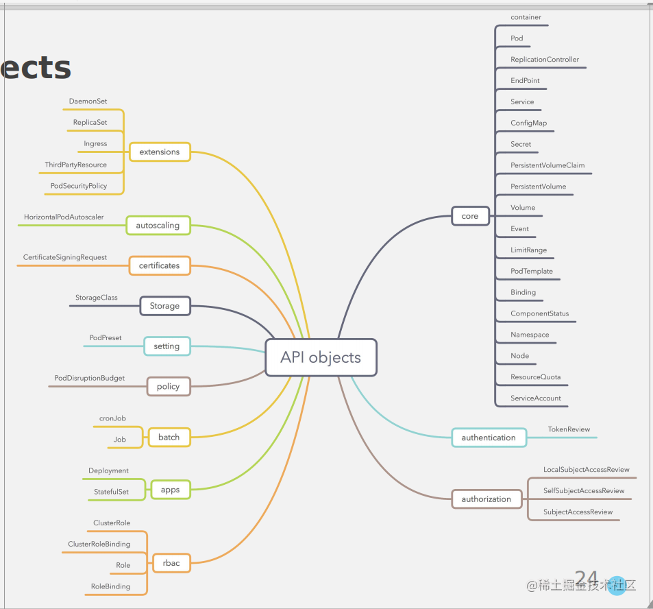

# K8S API资源—ApiGroup、Resources和Verbs


## Kubernetes API总览

REST API 是 Kubernetes 的基础架构。组件之间的所有操作和通信，以及外部用户命令都是 API Server 处理的 REST API 调用。因此，Kubernetes 平台中的所有资源被视为 API 对象，并且在 API 中都有对应的定义项。
## API 版本控制
为了消除字段或重组资源表示形式，Kubernetes 支持多个 API 版本，每个版本在不同的 API 路径下。例如：/api/v1 或者 /apis/extensions/v1beta1。
版本是在 API 级别而非资源或字段级别配置的：

确保 API 呈现出清晰一致的系统资源和行为视图。
允许控制对已寿终正寝的 API 和/或实验性 API 的访问。
JSON 和 Protobuf 序列化模式在出现模式变更时均遵循这些准则。以下说明同时适用于这两种格式。

```text
说明： API 版本和软件版本是间接相关的。API 和发布版本建议 描述了 API 版本和软件版本之间的关系。
不同的 API 版本表示不同级别的稳定性和支持级别。您可以在 API 变更文档 中找到有关每个级别的条件的更多信息。
```
以下是每个级别的摘要：

* Alpha：
  * 版本名称包含 alpha（例如，v1alpha1）。
  * 该软件可能包含错误。启用功能可能会暴露错误。默认情况下，功能可能被禁用。
  * 对功能的支持随时可能被删除，但不另行通知。
  * 在以后的软件版本中，API 可能会以不兼容的方式更改，亦不另行通知。
  * 由于存在更高的错误风险和缺乏长期支持，建议仅在短期测试集群中使用该软件。


* Beta：

  * 版本名称包含beta（例如，v2beta3）。
  * 该软件已经过充分测试。启用功能被认为是安全的。默认情况下启用功能。
  * 尽管细节可能会发生变更，对应功能不会被废弃。
  * 在随后的 Beta或稳定版本中，对象的模式和/或语义可能会以不兼容的方式更改。发生这种情况时，将提供迁移说明。迁移时可能需要删除、编辑和重新创建 API 对象。编辑过程可能需要一些思考。对于依赖该功能的应用程序，可能需要停机。
  * 该软件仅建议用于非关键业务用途，因为在后续版本中可能会发生不兼容的更改。如果您有多个可以独立升级的群集，则可以放宽此限制。


```text
说明： 请试用 Beta 版功能并提供反馈。功能结束 Beta 版之后，再进行变更可能是不切实际的。
```

* 稳定版：
  * 版本名称为 vX，其中X为整数。
  * 功能特性的稳定版本会持续出现在许多后续版本的发行软件中。


## API 结构组成
```text
https://127.0.0.1:6443/api/v1/pods
```

| 解释                 | 组成 |
|--------------------|----|
| API Server address |https://127.0.0.1:6443/ |
|Core API group  | api/v1|
|API Object|pods|
```text
https://127.0.0.1:6443/apis/extensions/v1beta/deployments
```

| 解释                 | 组成 |
|--------------------|----|
|API Server address | https://127.0.0.1:6443/|
|Core API group   |apis|
|API Group name | extensions|
|API Version |  v1beta|
|API Object| deployments|


## API 版本迭代
```text
Alpha level v1alpha1——>v1alpha2——>....——>v1alphaN
Beta level v1beta1——>v1beta2
Stable level v1
```
## API 版本列表
```text
apiGroups APIgroup就是apiversion中的一部分，apiversion = Apigroup/version
>>kubectl api-version
admissionregistration.k8s.io/v1
admissionregistration.k8s.io/v1beta1
apiextensions.k8s.io/v1
apiextensions.k8s.io/v1beta1
apiregistration.k8s.io/v1
apiregistration.k8s.io/v1beta1
apps/v1
authentication.k8s.io/v1
authentication.k8s.io/v1beta1
authorization.k8s.io/v1
authorization.k8s.io/v1beta1
autoscaling/v1
autoscaling/v2beta1
autoscaling/v2beta2
batch/v1
batch/v1beta1
certificates.k8s.io/v1beta1
coordination.k8s.io/v1
coordination.k8s.io/v1beta1
discovery.k8s.io/v1beta1
events.k8s.io/v1beta1
extensions/v1beta1
networking.k8s.io/v1
networking.k8s.io/v1beta1
node.k8s.io/v1beta1
policy/v1beta1
rbac.authorization.k8s.io/v1
rbac.authorization.k8s.io/v1beta1
scheduling.k8s.io/v1
scheduling.k8s.io/v1beta1
storage.k8s.io/v1
storage.k8s.io/v1beta1
v1  core: 一般在可以直接设为空
```
## API 列表图
s

## Resources
```text
$ kubectl api-resources -o wide
NAME                              SHORTNAMES   APIGROUP                       NAMESPACED   KIND                             VERBS
bindings                                                                      true         Binding                          [create]
componentstatuses                 cs                                          false        ComponentStatus                  [get list]
configmaps                        cm                                          true         ConfigMap                        [create delete deletecollection get list patch update watch]
endpoints                         ep                                          true         Endpoints                        [create delete deletecollection get list patch update watch]
events                            ev                                          true         Event                            [create delete deletecollection get list patch update watch]
limitranges                       limits                                      true         LimitRange                       [create delete deletecollection get list patch update watch]
namespaces                        ns                                          false        Namespace                        [create delete get list patch update watch]
nodes                             no                                          false        Node                             [create delete deletecollection get list patch update watch]
persistentvolumeclaims            pvc                                         true         PersistentVolumeClaim            [create delete deletecollection get list patch update watch]
persistentvolumes                 pv                                          false        PersistentVolume                 [create delete deletecollection get list patch update watch]
pods                              po                                          true         Pod                              [create delete deletecollection get list patch update watch]
podtemplates                                                                  true         PodTemplate                      [create delete deletecollection get list patch update watch]
replicationcontrollers            rc                                          true         ReplicationController            [create delete deletecollection get list patch update watch]
resourcequotas                    quota                                       true         ResourceQuota                    [create delete deletecollection get list patch update watch]
secrets                                                                       true         Secret                           [create delete deletecollection get list patch update watch]
serviceaccounts                   sa                                          true         ServiceAccount                   [create delete deletecollection get list patch update watch]
services                          svc                                         true         Service                          [create delete get list patch update watch]
mutatingwebhookconfigurations                  admissionregistration.k8s.io   false        MutatingWebhookConfiguration     [create delete deletecollection get list patch update watch]
validatingwebhookconfigurations                admissionregistration.k8s.io   false        ValidatingWebhookConfiguration   [create delete deletecollection get list patch update watch]
customresourcedefinitions         crd,crds     apiextensions.k8s.io           false        CustomResourceDefinition         [create delete deletecollection get list patch update watch]
apiservices                                    apiregistration.k8s.io         false        APIService                       [create delete deletecollection get list patch update watch]
controllerrevisions                            apps                           true         ControllerRevision               [create delete deletecollection get list patch update watch]
daemonsets                        ds           apps                           true         DaemonSet                        [create delete deletecollection get list patch update watch]
deployments                       deploy       apps                           true         Deployment                       [create delete deletecollection get list patch update watch]
replicasets                       rs           apps                           true         ReplicaSet                       [create delete deletecollection get list patch update watch]
statefulsets                      sts          apps                           true         StatefulSet                      [create delete deletecollection get list patch update watch]
tokenreviews                                   authentication.k8s.io          false        TokenReview                      [create]
localsubjectaccessreviews                      authorization.k8s.io           true         LocalSubjectAccessReview         [create]
selfsubjectaccessreviews                       authorization.k8s.io           false        SelfSubjectAccessReview          [create]
selfsubjectrulesreviews                        authorization.k8s.io           false        SelfSubjectRulesReview           [create]
subjectaccessreviews                           authorization.k8s.io           false        SubjectAccessReview              [create]
horizontalpodautoscalers          hpa          autoscaling                    true         HorizontalPodAutoscaler          [create delete deletecollection get list patch update watch]
cronjobs                          cj           batch                          true         CronJob                          [create delete deletecollection get list patch update watch]
jobs                                           batch                          true         Job                              [create delete deletecollection get list patch update watch]
certificatesigningrequests        csr          certificates.k8s.io            false        CertificateSigningRequest        [create delete deletecollection get list patch update watch]
leases                                         coordination.k8s.io            true         Lease                            [create delete deletecollection get list patch update watch]
endpointslices                                 discovery.k8s.io               true         EndpointSlice                    [create delete deletecollection get list patch update watch]
events                            ev           events.k8s.io                  true         Event                            [create delete deletecollection get list patch update watch]
ingresses                         ing          extensions                     true         Ingress                          [create delete deletecollection get list patch update watch]
ingresses                         ing          networking.k8s.io              true         Ingress                          [create delete deletecollection get list patch update watch]
networkpolicies                   netpol       networking.k8s.io              true         NetworkPolicy                    [create delete deletecollection get list patch update watch]
runtimeclasses                                 node.k8s.io                    false        RuntimeClass                     [create delete deletecollection get list patch update watch]
poddisruptionbudgets              pdb          policy                         true         PodDisruptionBudget              [create delete deletecollection get list patch update watch]
podsecuritypolicies               psp          policy                         false        PodSecurityPolicy                [create delete deletecollection get list patch update watch]
clusterrolebindings                            rbac.authorization.k8s.io      false        ClusterRoleBinding               [create delete deletecollection get list patch update watch]
clusterroles                                   rbac.authorization.k8s.io      false        ClusterRole                      [create delete deletecollection get list patch update watch]
rolebindings                                   rbac.authorization.k8s.io      true         RoleBinding                      [create delete deletecollection get list patch update watch]
roles                                          rbac.authorization.k8s.io      true         Role                             [create delete deletecollection get list patch update watch]
priorityclasses                   pc           scheduling.k8s.io              false        PriorityClass                    [create delete deletecollection get list patch update watch]
csidrivers                                     storage.k8s.io                 false        CSIDriver                        [create delete deletecollection get list patch update watch]
csinodes                                       storage.k8s.io                 false        CSINode                          [create delete deletecollection get list patch update watch]
storageclasses                    sc           storage.k8s.io                 false        StorageClass                     [create delete deletecollection get list patch update watch]
volumeattachments                              storage.k8s.io                 false        VolumeAttachment                 [create delete deletecollection get list patch update watch]
```
```text
说明：kubernetes 1.17版本
```

## Verbs
```sql
[create delete deletecollection get list patch update watch]
```
```text
说明：kubernetes 1.17版本
```

## 角色示例
在以下示例中，我们仅截取展示了 rules 对应部分， 允许读取在核心 API 组 下的 Pods:
```makefile
rules:
- apiGroups: [""]
  resources: ["pods"]
  verbs: ["get", "list", "watch"]
```
允许读/写在 “extensions” 和 “apps” API 组中的 “deployments” 资源：
```makefile
  rules:
- apiGroups: ["extensions", "apps"]
  resources: ["deployments"]
  verbs: ["get", "list", "watch", "create", "update", "patch", "delete"]
```
允许读取 “pods” 和读/写 “jobs” :
```makefile
  rules:
- apiGroups: [""]
  resources: ["pods"]
  verbs: ["get", "list", "watch"]
- apiGroups: ["batch", "extensions"]
  resources: ["jobs"]
  verbs: ["get", "list", "watch", "create", "update", "patch", "delete"]
```
允许读取名称为 “my-config”的 ConfigMap （需要通过 RoleBinding 绑定带某名字空间中特定的 ConfigMap）：
```makefile
  rules:
- apiGroups: [""]
  resources: ["configmaps"]
  resourceNames: ["my-config"]
  verbs: ["get"]
```
允许读取在核心组中的 “nodes” 资源（因为 Node 是集群范围的，所以需要 ClusterRole 绑定到 ClusterRoleBinding 才生效）
```makefile
  rules:
- apiGroups: [""]
  resources: ["nodes"]
  verbs: ["get", "list", "watch"]
```
允许在非资源端点 “/healthz” 和其子路径上发起 “GET” 和 “POST” 请求（必须在 ClusterRole 绑定 ClusterRoleBinding 才生效）
```makefile
  rules:
- nonResourceURLs: ["/healthz", "/healthz/*"] # '*' 在 nonResourceURL 中的意思是后缀全局匹配。
  verbs: ["get", "post"]
```
