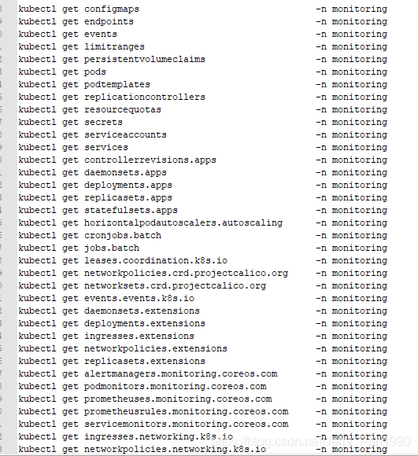
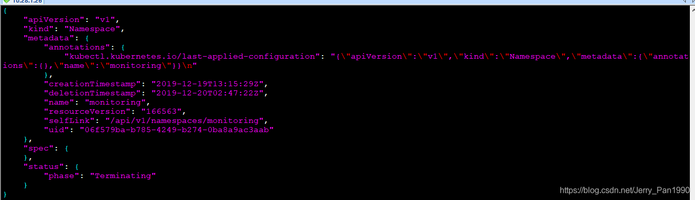
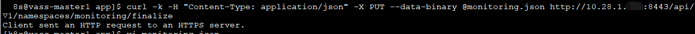

# 解决k8s中命名空间无法删除的问题

情况：

Kubectl delete ns XXXX 后， namespace 一直处于 Terminating 状态。

使用：

kubectl delete ns monitoring --grace-period=0 –force

后，也无法删除。

原因分析：

删除时，报错：

warning: Immediate deletion does not wait for confirmation that the running resource has been terminated. The resource may continue to run on the cluster indefinitely.

Error from server (Conflict): Operation cannot be fulfilled on namespaces " monitoring ": The system is ensuring all content is removed from this namespace.  Upon completion, this namespace will automatically be purged by the system.

这是因为 k8s 认为当前命名空间内，还存在未释放资源，它告诉咱们一旦该命名空间下，所以资源释放操作完成，命名空间会自动被清除掉。

实际观察，可以发现，该命令执行后，namespace也一直卡住，究其原因，应该是的确有部分资源未释放。

解决思路：

1、首先查看该命名空间下所有资源：

kubectl api-resources -o name --verbs=list –namespaced

这条命令可以查看你声明过的资源类型。

2、然后使用 kubectl get 资源类型 –n 命名空间

查看是否真的存在未释放的资源。

3、最终结果是，命名空间下全部资源都是No Resources没有！

网上这份资料提供了另一种解决思路：

https://my.oschina.net/u/4222205/blog/3113044

1、首先通过

kubectl get namespace monitoring -o json > monitoring.json

这条命令，将当前的命名空间以 json文件的形式导出。

2、将 spec 下的内容删除：这一步骤的目的在于将内容清空后，以空内容的ns覆盖原有ns，这样保证了要删除的ns内容为空，删除的命令也就无法阻塞了

3、将具体内容为空的 namespace ，通过 api-server 接口，覆盖到k8s集群中
需要注意的是：由于当前我们k8s主节点使用了认证，如果你直接使用以下命令，调用虚拟IP的api-server接口，会发现请求发送成功，但是没有响应的情况，如下：

4、针对有认证的情况，需要使用 kube-proxy 进行代理：
kubectl proxy --port=8081
通过这一条命令，可以在本机使用kube-proxy将 api-server代理到本地 8081端口上，这样就绕过了k8s的认证。
需要注意的是，使用 kubectl proxy 命令没有使用守护模式，一次一旦你 Ctrl+c 后，就会发现，netstat –nlp | grep 8081 监听的端口也没有了。

正确的做法是：打开k8s主节点的两个窗口，
在一个窗口中执行 kubectl proxy
另一个窗口中执行：
curl -k -H "Content-Type: application/json" -X PUT --data-binary @monitoring.json http://127.0.0.1:8081/api/v1/namespaces/monitoring/finalize

这个办法解决的原理与强制重启pod的命令其实是一样的：

kubectl get pod PODNAME -n NAMESPACE -o yaml | kubectl replace --force -f –

将现有状态导出，再执行覆盖