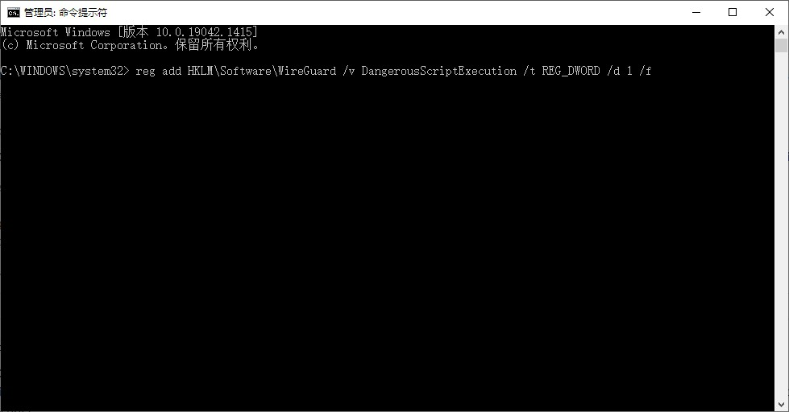
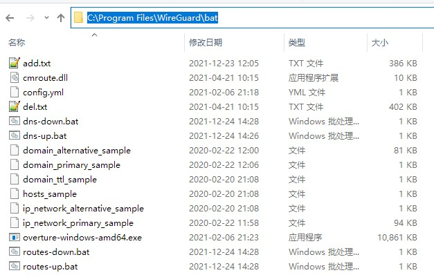
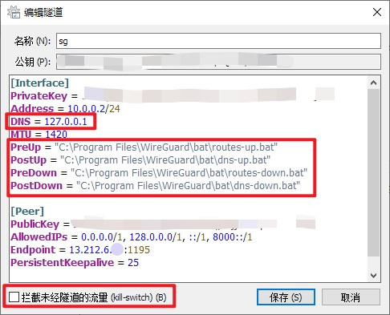

---
title: wireguard
top: true
date: 2023-06-10 08:21:51
tags:
---

## 介绍


笔者之前在Github上有一个项目，提供方法来为Windows平台上的全局代理VPN添加国内IP/域名分流功能。

在建立项目之时，Wireguard官方客户端并未支持Pre/Post execution hooks。因此当时推荐使用Tunsafe作为替代客户端。

但从0.3.1版本开始，Wireguard官方客户端已支持execution hooks (虽然此功能默认关闭)，并且截至现时Tunsafe已多年没有更新。

故此文将介绍如何开启官方客户端的脚本功能并利用此功能在Wireguard建立连接时对国内IP及域名进行分流。

## 分流原理

目前项目采用的分流方式主要是：

* 路由表分流。通过将国内/大陆IP与默认网卡进行绑定，让国内的IP都走默认网卡（你的默认网络）。其余国外IP走虚拟网卡（你的代理网络）
* DNS分流。通过配置overture，将国内/大陆IP和一些常用的国内域名与国内的DNS进行绑定，其余国外IP与国外DNS绑定，进一步加强分流的准确性。因为某些国内的网站或服务会部署海外CDN，当使用海外的DNS解析这些域名时，将会得到海外CDN的IP地址，此时虽然访问的是国内的网站或服务，但由于解析得到的是一个海外IP，因此流量仍会经过代理。

## 分流原理


1. 下载并安装最新版本的官方PC客户端。一般会安装在目录”C:\Program Files\WireGuard”

2. 开启Wireguard的Pre/Post命令支持，只能通过修改注册表的方式开启，具体操作：
* 以管理员身份运行cmd
* 输入以下命令按回车
```
reg add HKLM\Software\WireGuard /v DangerousScriptExecution /t REG_DWORD /d 1 /f
```


3. 下载[此页面](https://github.com/lmc999/auto-add-routes/tree/master/wireguard)中的所有文件到”C:\Program Files\WireGuard\bat”。或者直接下载解压[此压缩档](https://github.com/lmc999/auto-add-routes/blob/master/zip/wireguard.zip)

4. 修改Wireguard客户端配置文件，加入以下Script Hook调用”C:\Program Files\WireGuard\bat”的批处理文件
```text
PreUp = "C:\Program Files\WireGuard\bat\routes-up.bat"
PostUp = "C:\Program Files\WireGuard\bat\dns-up.bat"
PreDown = "C:\Program Files\WireGuard\bat\routes-down.bat"
PostDown = "C:\Program Files\WireGuard\bat\dns-down.bat"
```
将DNS指向本机以使用Overture作为DNS服务器
```text
将DNS指向本机以使用Overture作为DNS服务器

```
关闭Wireguard的kill switch并保存修改


5. 如配置正确，此时点击连接Wireguard会⑴自动调用routes-up.bat将国内IP写进系统路由表，⑵启动overture DNS服务器
## 连接成功后可上[ip.skk.moe](https://ip.skk.moe/)测试一下看是否正确分流。
## 结尾
如果这篇文章帮到你，请到[Github项目](https://github.com/lmc999/auto-add-routes)点个star

